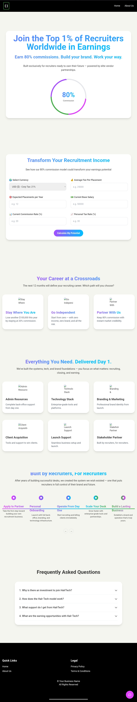

# HalrTech Template Documentation

## Overview
This documentation provides instructions for using the HalrTech-inspired React template for your business website. The template is built with React, TypeScript, and Tailwind CSS, offering a modern, responsive design with interactive components.

## Template Features
- Modern, clean design with gradient text effects
- Responsive layout that works on mobile and desktop
- Interactive components (calculator, FAQ accordion, etc.)
- Customizable sections for your business needs
- Built with React and TypeScript for maintainability


## Demo

Here's a quick look at the web application:



## Getting Started

### Prerequisites
- Node.js (v16 or higher)
- npm or pnpm package manager

### Installation
1. Extract the template files to your desired location
2. Navigate to the project directory in your terminal
3. Install dependencies:
   ```
   pnpm install
   ```
   or
   ```
   npm install
   ```

### Development
To start the development server:
```
pnpm run dev
```
or
```
npm run dev
```

This will start the development server at http://localhost:5173

### Customization

#### Updating Content
1. Open the `src/App.tsx` file to modify the main layout and component arrangement
2. Each section is a separate component in the `src/components` directory
3. Update the text, images, and other content in each component file

#### Styling
- Global styles are in `src/index.css`
- Component-specific styles are in `src/App.css`
- The template uses Tailwind CSS for styling, allowing easy customization

#### Colors
The main color scheme is defined in `src/index.css` with CSS variables:
```css
:root {
  --primary-purple: #a64dff;
  --primary-blue: #00bfff;
  --background: #f5f5f0;
  --text-dark: #333333;
  --accent-pink: #e040fb;
  --accent-green: #4caf50;
  --accent-blue: #2196f3;
}
```

Update these values to match your brand colors.

### Building for Production
To build the project for production:
```
pnpm run build
```
or
```
npm run build
```

This will create a `dist` directory with optimized production files.

## Template Structure

### Key Components
- **Navbar**: Top navigation bar with logo and links
- **Hero**: Main landing section with headline and circular chart
- **Calculator**: Interactive form with input fields
- **CareerSection**: Three-column comparison layout
- **FeaturesSection**: Grid of feature cards with icons
- **ProcessTimeline**: Interactive process flow visualization
- **FAQSection**: Expandable questions and answers
- **Footer**: Site links and copyright information

### Files and Directories
- `src/components/`: Contains all React components
- `src/assets/`: Place for images and other static assets
- `public/`: Public assets like favicon and index.html
- `src/App.tsx`: Main application component
- `src/index.css`: Global styles
- `src/App.css`: Application-specific styles

## Customization Tips
1. Replace placeholder icons with your own images in the `public/assets/` directory
2. Update the color scheme to match your brand identity
3. Modify the calculator functionality to suit your business model
4. Add or remove sections as needed for your content
5. Update the navigation links to point to your pages

## Support
For questions or support with this template, please contact your template provider.
